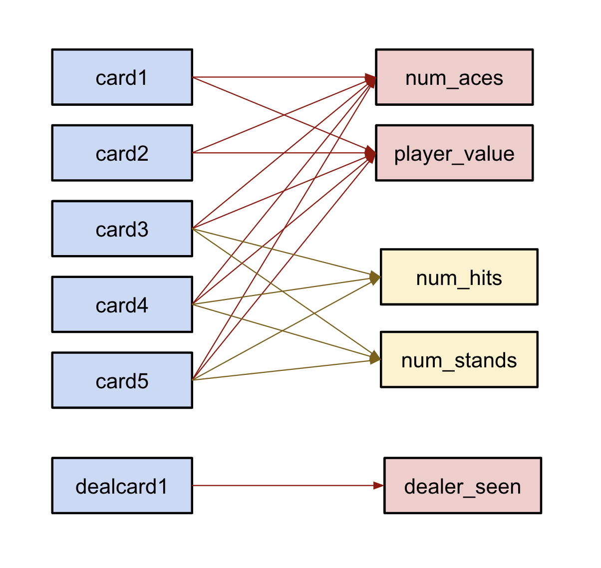
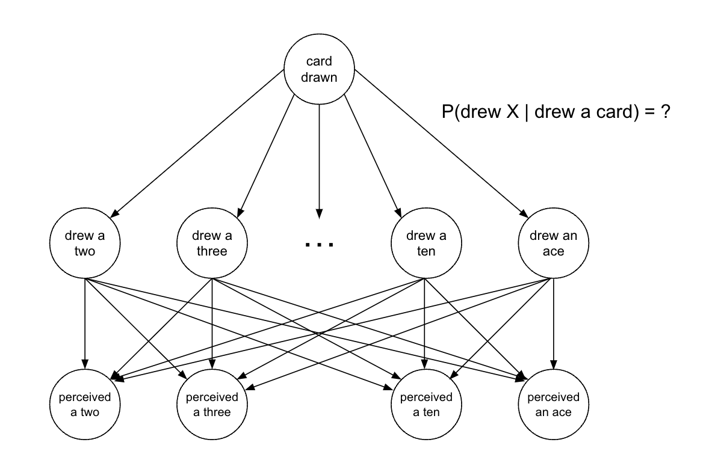
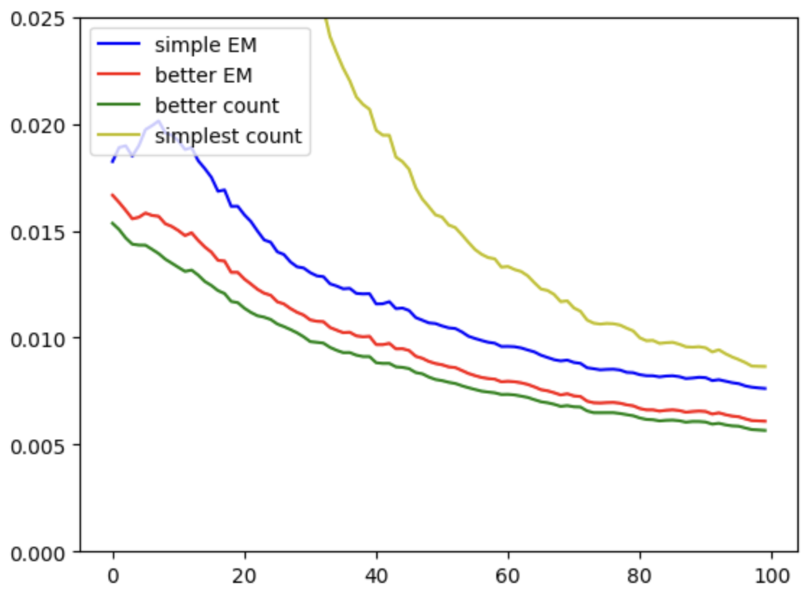
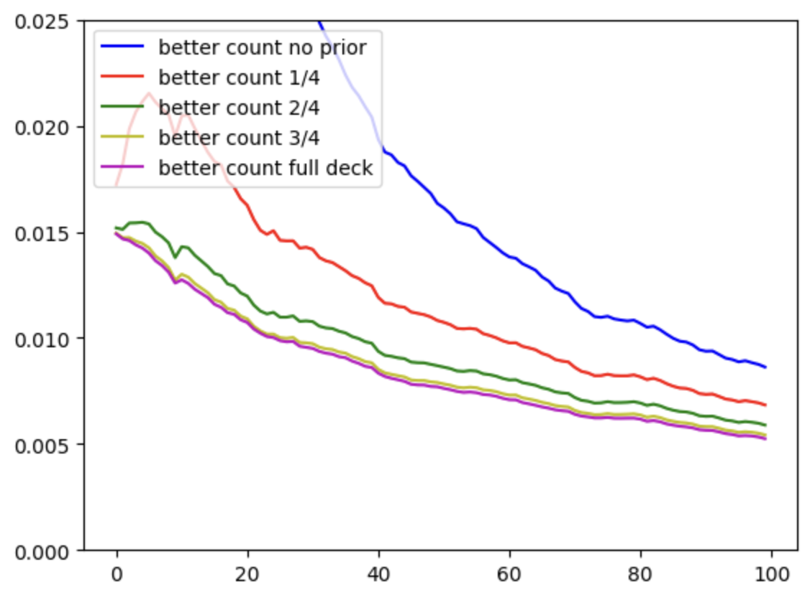
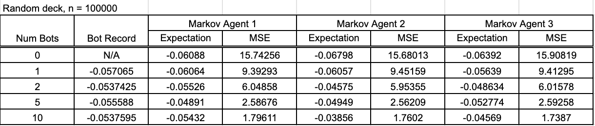
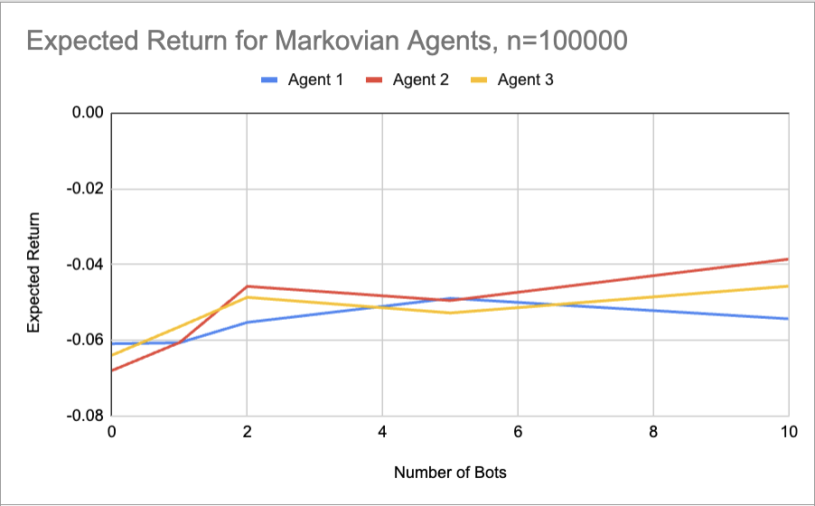
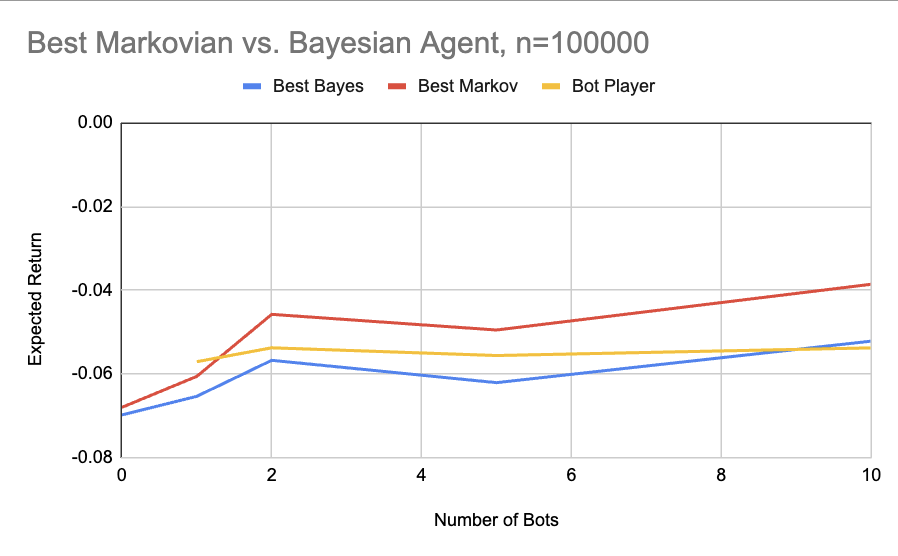
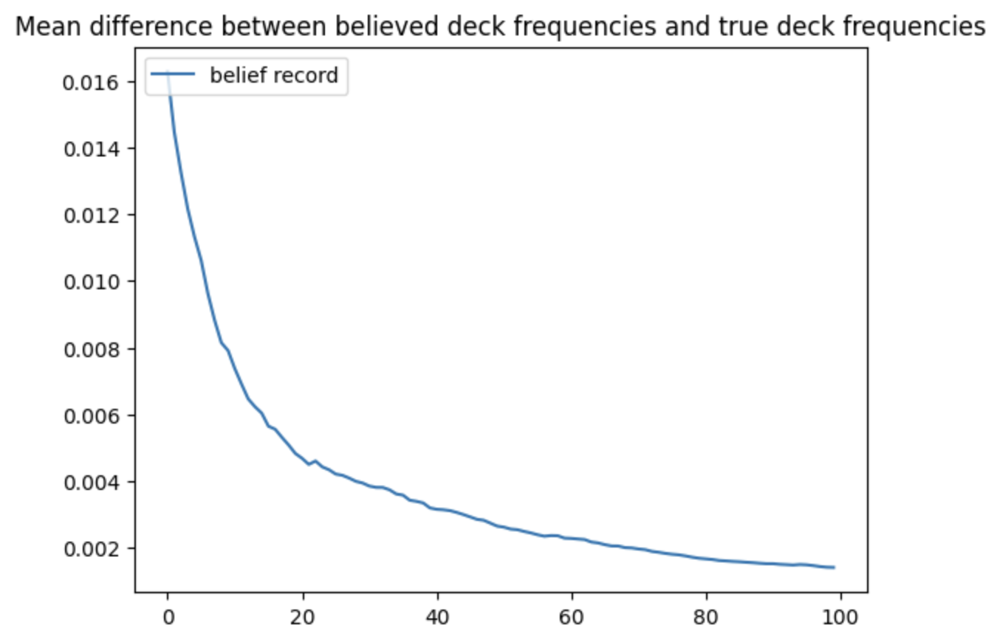

### PEAS/Agent Analysis

`Performance Measure`: We measure the performance of our bot by the average amount of money won/lost per dollar it puts into the game. For example, in the table under the Results and Conclusion section, you can see that "Markov Agent 2" has an expected return of -0.03856 when playing with 10 other players. This means for every $1 it puts in, it is expected to lose 3.856 cents. For reference, a player using perfect strategy (without splitting or doubling down) has an expected loss of about 2% when they can see all cards and are playing with a standard deck, so we'd like our bot to get as close to that as possible.

We also measure the MSE (mean square error) of our bot's best guess of what the dealer's shown card is versus what it actually is to get a sense of how it's doing relative to how many players there are, but that's not what the bot is ultimately trying to optimize for.

For our new model, we also measured the MSE between our believed and the actual deck, which we randomized.

`Environment`: The environment includes: the dealer's two cards (both of which are hidden from our agent), the cards of all other players, the decisions of the other players depending on what they see from the dealer, and the deck. Importantly, the deck is random—every card has a value randomly taken from the 13 possible cards in a standard deck, so playing a standard strategy might not be optimal.

`Actuators`: The agent only has the ability to choose whether to hit or stand.

`Sensors`: The agent ONLY senses the decisions the other players make alongside what cards they have. That means it has no clue what card the dealer has, which is typically an essential part of a blackjack player's strategy. The agent also doesn't have a sensor to see what cards are in the random deck.

### Dataset Explanation

We process our data [in this notebook](CSE_150A_Project_Clean_Data.ipynb).

In our [raw dataset](blkjckhands.csv), each row describes one player's round of blackjack. The important variables (columns) in our dataset for each row are: `card1` through `card5`, as well as `dealcard1`. Within the data, `dealcard1` is the dealer's first card, which is visible to all other players but not our agent. Then, `card1` through `card5` are the values of the cards that each player from the dataset received in order. If the player never received a third, fourth, or fifth card, the respective values are 0. 

We use `card1` through `card5` for several purposes: for one, it lets us understand the state of the game both in terms of the number of aces at play and the value of the player's hand. The other usage is that reading `card3` through `card5` tells us whether the players chose to hit or not at each state. Then, `dealcard1` also helps define the state of the game.

Briefly speaking, we count the number of times hit or stand based on different states of the game. The relationship between these variables and the data we process from them is visualized below:



For a more detailed description, we initialize a multi-layered dictionary first indexed by the dealer's possible visible cards. Then, the next layer is indexed by the player's possible hand value up to 22 (anything above gets set to 22). Then, the next layer is indexed by the number of aces we saw from the player, up to 2. In total, these each represent a possbile state for the player. Finally, the last layer has an integer for number of hits and an integer for the number of stands for each state.

For each row, we figure out how many aces the player received by checking `card1` through `card5` for ones and elevens. We then sum up the player's total hand value, treating as many aces as 11 as we can without going over 21 total value. We then iterate through the player's `card3` through `card5`, tracking the state which consists of the player's hand and `dealcard1` before receiving new cards. If the player receives a card, we increment the number of hits we saw in the state in our dictionary by 1. If the player does not receive a card, we increment the number of stands we saw by 1 and move on to the next row.

Then, our dictionary is written row-by-row in `dealer_seen,player_value,num_aces,num_hits,num_stands` CSV format in [blkjck_clean.csv](blkjck_clean.csv).

Using this resulting data written in [blkjck_clean.csv](blkjck_clean.csv), we can calculate the probabilities the players will hit or stand given their current situation (variables in red). Then, our agent can view the history of players hitting or standing during a round to compare to these probabilities to help calculate the probability of the dealer's card being each value to make a more informed decision.

### Agent Setup

#### Previous Agent

As a refresher, here is an image of how our bayesian agent was setup in Milestone 2 as we will refer back to it for comparison.


#### New Agent

For our new agent, we chose a modified EM algorithm to model our agent. Initially, we considered the following model:



We considered this model at first because we were worried that relying only on the exact data that we have encountered may result in overfitting, especially during the early rounds which could cause extra losses.

For example, if we have only seen a ten, seven, and four thus far in the first round, relying solely on the exact data would cause the agent to believe that the deck solely consists of those three cards, which is extremely unlikely.

So, we added an extra layer to the bottom of our network where upon drawing a certain card, say a two, we could potentially perceive it as any other card. In order to ensure that the data was still accurate, we had a high chance (91%) to perceive it as a two and a low chance to perceive it as the others (1% per other card).

However, we found this model to be worse than the alternative method we ended up choosing, the data for which we have visualized in the following graph:



The y-axis represents the mean-squared error between our believed probabilities and the true frequencies for the deck. The x-axis represents how many cards we have seen. 

The simplest count line represents the method of just averaging the number of counts of a certain card over the total cards seen. On the graph, for early counts, the error is so high that including it would make the rest of the graph unreadable. This is a standard EM algorithm without the chance of misperception.

The simple EM line represents the error of the method described above. 

The better EM line represents the error of a similar method, with a small modification of reducing the odds of an "incorrect perception" as we see more cards.

Finally, the better count line represents the method we ended up choosing, which initializes a set of dummy data to ensure that we do not initially overfit to what we've seen. As can be seen on the graph, this method has the lowest mean-squared error. 

As for choosing how we initialized our dummy data, we went through a couple possiblities on how much dummy data we want to incorporate. Testing these possibilities, we found the following data:



Once again, the y-axis is the mean-squared error from the true frequencies, and x-axis is how many cards we have seen.

As seen in the graph, the best ways we found to initialize our dummy variable was either with 3/4 of a standard deck or with a full standard deck. Ultimately, we chose to go with 3/4 of a standard deck because we wanted to account for outliers, and the difference in how long it takes to converge between these two methods is very small.

### Training

*For this model, one component of our training method was essentially the same way of calculating the CPT's as from the previous milestone. However, we also have an additional component where we update our belief of the deck as the rounds go on during testing, which will be detailed in the next subsection.*

#### CPT Calculations from Previous Model

We based our training on a data set of 900,000 hands of blackjack. We used likelihood maximization to determine the CPTs for our Bayesian Network.

During training, we had full visibility of what the dealer's shown card was when players made decisions whether to hit or stand, so we could simply determine the counts of each kind of decision to fill out the probability table.

In particular, we went through `blkjckhands.csv` (which we got from Kaggle) and simulated each game to create a tally of each player's decisions in a given position. Then we summarized that cleaned data in `blkjck_clean.csv`, which we can load quickly into our CPTs by simply dividing the number of hits by the total number of hits plus stands for each state (to see the specific implementation of how we processed this data, see [this notebook](CSE_150A_Project_Clean_Data.ipynb)).

When we start our agent, in order to calculate our CPT's, we run this function:

```python
def read_data(filename):
    data = np.ndarray([12, 22, 3])

    with open(filename, 'r') as f:
    i = 0
    # When passing in the clean data file, each row represents a possible state in terms of dealer card and player hand
    for row in f:
        i += 1
        if i == 1:
            continue

        items = row.split(",")
        hits = int(items[3])
        stands = int(items[4])

        if hits == 0 and stands == 0:
            # We have never seen this state in our dataset, so we default to a 50/50 chance
            data[int(items[0])][int(items[1])][int(items[2])] = 0.5
        else:
            # Take the empirical chance of hitting with this state
            data[int(items[0])][int(items[1])][int(items[2])] = hits / (hits + stands)

    return data
```

A simplifying assumption we made was that a player's decision would be approximately the same whenever they had 2 or more aces (that is, we compacted any state with 3 or more aces into the one with only 2 aces). This was to prevent our agent from overfitting to our data; otherwise, we might have a freak event where a player has 5 aces and a total value of 14 and our agent can determine exactly what card the dealer has with 100% certainty.

Another simplifying assumption we made was that in any state that the data set had never reached, a player would simply randomly choose between hitting and standing with 50-50 odds. These states are so rare that they aren't that impactful, but this was better than simply resetting the round.

A final simplifying assumption we made is that the players in our game will continue to play like the players from our data with equal probability as what we saw in the data set. That is, our bot players will follow the CPTs exactly. This might give a slight unfair advantage to our agent since it guarantees our CPTs are accurate, but the other option would have been to only play rounds that actually happened in the data set, which we thought would've been a worse solution.

#### New Training for Believed Deck

In order to calculate our believed distribution for the deck, we have the following code that runs every time the agent takes a turn: If our believed deck has not been initialized with the dummy data, we initialize it. Then, if it is the agent's first turn of the round, we parse all the choices thus far in the round with the `parse_player_choices` function:

```python
def parse_player_choices(choice_list):
    for p in choice_list:
        # We check that this particular choice doesn't represent a hit to avoid duplicates
        if p[2] != 1:
            for card in p[3]:
                # Increment total counts for each card seen
                markov.belief[card] += 1
```

We use this function to process all the choices made thus far in the current round: While iterating through each choice, we filter to only choices that are not hits so we can avoid duplicate hands. Then, for each remaining choice, we go through the hand of the player and increment the counts of the cards in that hand accordingly. Therefore, as the rounds pass, we will build an idea in `markov.belief` of what cards have been in play, which tells us about the distribution of the deck.

After we are done parsing player choices, we build a new 52-card deck using the distribution found from the total counts, which is what we expect the deck to currently be. From our expected deck, we remove all the cards we have seen thus far in the current round, which gives us our expectation of the counts of cards that are left in the deck. Using these counts, we can calculate a new distribution of the deck in the current state of the game.

```python
# Initialize dummy data on first pass
if markov.belief is None:
    markov.belief = {2: 3, 3: 3, 4: 3, 5: 3, 6: 3, 7: 3, 8: 3, 9: 3, 10: 12, 11: 3}

player_choices = args[0]
choice_list = args[1]
card1, card2 = args[2]

# On the first iteration of a given round, update our total counts to update our belief
if not markov.has_updated:
    parse_player_choices(choice_list)
    markov.belief[card1] += 1
    markov.belief[card2] += 1
    markov.has_updated = True

# Construct a "current" 52 card deck matching our current belief
expected_cards = {key: value * 52 / sum(markov.belief.values()) for key, value in markov.belief.items()}

# Remove cards that have already appeared in play this round from constructed deck
expected_cards[card1] = max(expected_cards[card1]-1, 0)
expected_cards[card2] = max(expected_cards[card2]-1, 0)
for p in choice_list:
    # We check that this particular choice isn't a hit to avoid duplicates
    if p[2] != 1:
        for card in p[3]:
            expected_cards[card] = max(expected_cards[card]-1, 0)

prob_dict = {key: value / sum(expected_cards.values()) for key, value in expected_cards.items()}
```

We now can use this distribution to help us predict what the dealer's visible card is along with our CPT's.

### Results and Conclusion

For our testing, we kept track of the expected return from a game of blackjack on a wager of one dollar, as well as the mean-squared error of our predicted visible dealer card and the actual visible dealer card. We tested three agents: Markov agent 1, 2, and 3.

Markov agent 1 was our first rendition, where we only kept track of the believed total deck. Markov agent 2 was our second version, where we subtracted the cards we have seen thus far during a given round from our believed total deck. Finally, Markov agent 3 has a changed DP algorithm for calculating the expected returns of standing versus hitting compared to Markov agent 2. We also tested our three versions with different numbers of bot players, and kept track of the return of the bot players as well. Our data can be shown in the following table:



To begin, we compared the data of the three Markov agents with the following graph of their expected returns:



We can see that the agent with the best return is Markov agent 2. This means that keeping track of the cards that have been used during the current round gives us a slight advantage, but having a more precise DP did not seem to make a difference (or perhaps makes the agent perform worse).

Notably, as the bots increase, not keeping track of which cards have been used hinders the performance of Markov agent 1 compared to agent 2 because more bots means more cards have been seen so we can get a stronger estimate of what the remaining cards in the deck are.

Then, we compared the results from the bot player, the Bayesian agent from Milestone 2, and our new Markov agent 2 with the following graph:



As we can see in the graph, the Markov agent outperforms both the bot player and the Bayesian by about one cent on the dollar. We were hoping to see a greater increase in expected return, but nonetheless, this is an improvement. In the improvements section, we will talk about how we could make this even better.

Another test we ran was a comparison between our believed deck and the actual deck as rounds passed with one bot player. We calculated the mean-squared error between the distribution our agent thought the deck had versus the true distribution with this function:

```python
def squared_error(belief, actual):
    return sum([(belief[i] - actual[i]) ** 2 for i in range(2, 12)])
```

Then, we graphed our data:



The y-axis is the mean-squared error, while the x-axis is the number of rounds that we have played. As can be seen with the graph, as more and more rounds pass, our agent's belief becomes more accurate. This is expected and is the reason why we chose to design an agent using this model, but it is good to verify that this model works in practice.

### Improvements

As with the previous Milestone, one point we could improve on is giving our agent the option to double down, split, and surrender. We would have liked to implement this, but because we only had one more milestone, we decided to focus more on developing the aspects of the model most relevant to the topics from this class, since adding these options are more tangential. 

Additionally, we also would have liked to made a better algorithm for calculating the expected value of standing versus hitting. In its current state, as we make our calculations, we assume all the probabilities are with replacement, which is not accurate to how the game plays out. In a typical blackjack setting, you would calculate all possible draws because the deck is static. However, because that is not the case in our scenario (our belief of the deck changes with every hand), this would be very costly in computing power. Nonetheless, it could be interesting to explore how to implement this improvement.