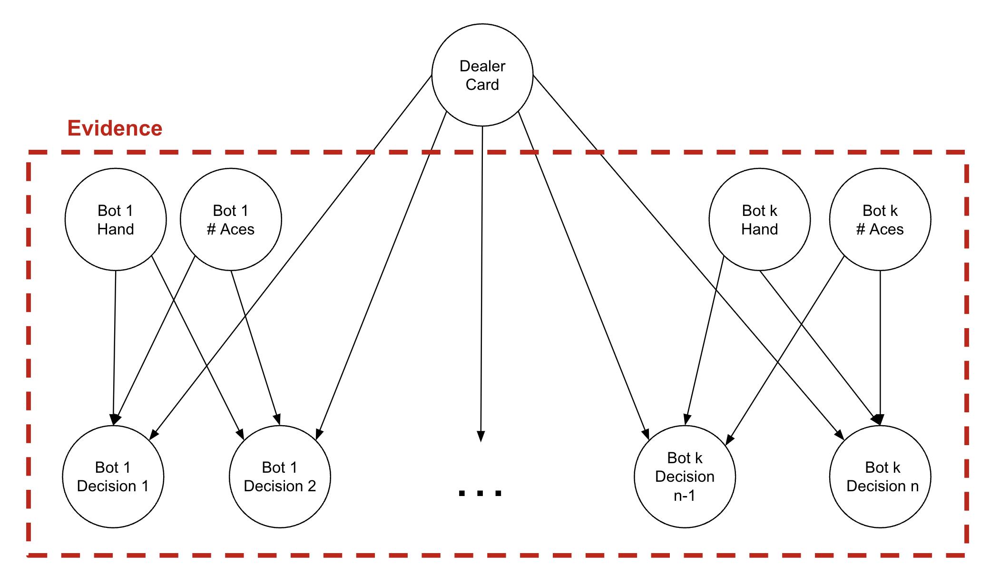
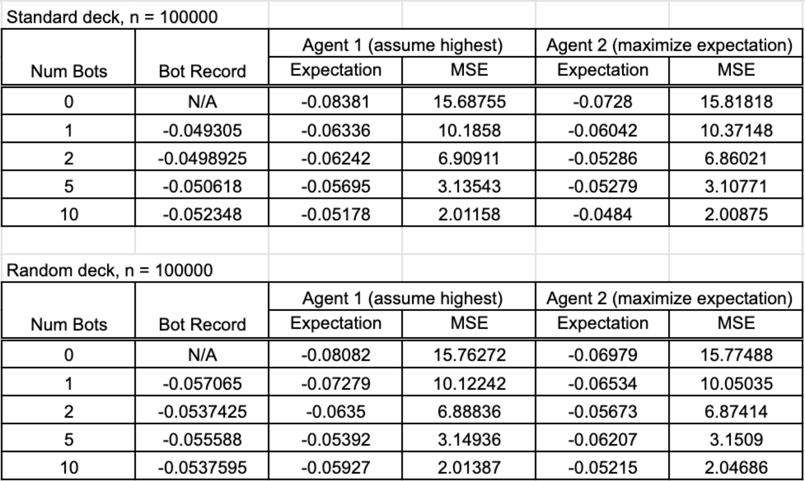
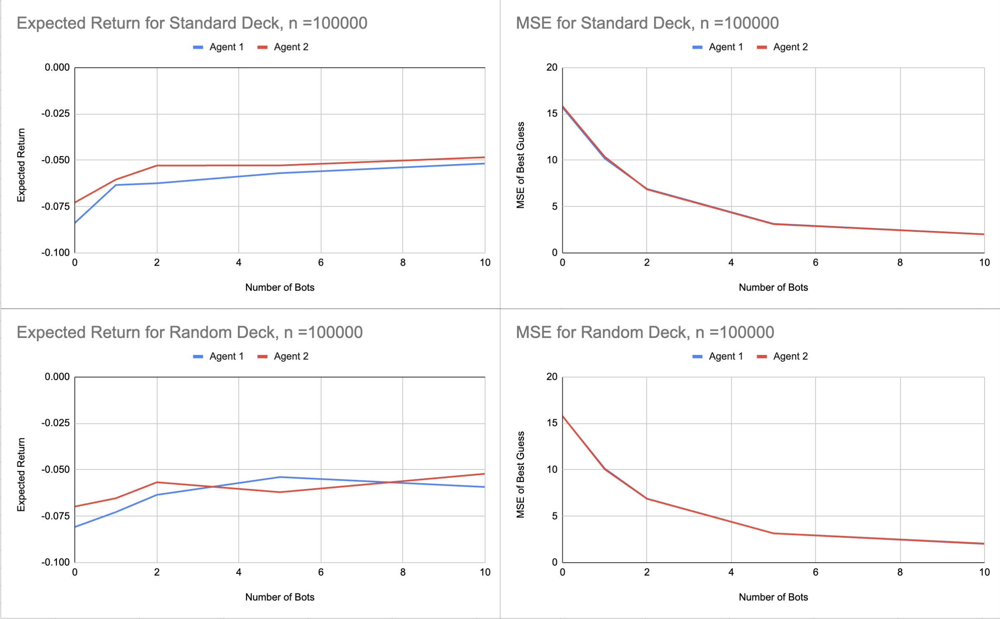

### Agent PEAS 

Our agent’s performance measure is the average amount of money won (or lost) in a game. Its environment consists of the randomized deck of cards, the other players at the table (bots in this case), and the dealer. Specifically, the other players at the table also play a round of blackjack prior to our agent’s turn. Each other player has cards that they start with and can hit to gain more cards according to a stochastic algorithm. 

The dealer also starts with two cards, and also can eventually hit to gain more cards while following a strict algorithm. Regarding actuators, our agent can choose whether it wants to stand, or to hit to gain another card. Our agent’s sensors allow it to see the cards and actions of the other players at the table, along with its own cards, and uses that information to make its decision. It can not see any card of the dealer, despite the other players being able to. 

### Data Processing

We process our data [in this notebook](CSE_150A_Project_Clean_Data.ipynb).

In our [raw dataset](blkjckhands.csv), each row describes one player's round of blackjack. We initialize a multi-layered dictionary first indexed by the dealer's possible visible cards. Then, the next layer is indexed by the player's possible hand value up to 22. Then, the next layer is indexed by the number of aces we saw from the player, up to 5. In total, these each represent a possbile state for the player. Finally, the last layer has an integer for number of hits and an integer for the number of stands for each state.

For each row, we figure out how many aces the player received. We then sum up the player's total hand value, treating as many aces as 11 as we can without going over 21 total value. We then iterate through the player's third, fourth, and fifth card, tracking the state of the player's hand before receiving each card. If the player receives a card, we increment the number of hits we saw in the state by 1. If the player does not receive a card, we increment the number of stands we saw by 1 and move on to the next row.

Then, our dictionary is written row-by-row in `dealer_seen,player_value,num_aces,num_hits,num_stands` CSV format in [blkjck_clean.csv](blkjck_clean.csv).

### Agent Setup and Modeling

Our agent is a goal-based agent, particularly using its current expectations of the dealer’s hand to figure out how to win each round of blackjack. In particular, we processed our dataset of blackjack games to organize the number of times players hit versus stand given both their hands and the dealer’s visible card. Then, using the sequence of choices to hit or stand by the bots in the round given their hands as evidence, we then can calculate the probability we see that evidence for each possible dealer card to guess what the dealer’s visible card is. 

We are calculating `P(Dealer_Card=card|evidence)` for each possible `card`, and where `evidence` is the collection of choices the bots made given their state (hand and number of aces). Since we also know the state of each bot's hand as they make their decisions, those states are also in our evidence.

### Implementation

To explore how we benchmarked our agents, click on [this link](CSE_150A_Play_Blackjack.ipynb).

To explore how we implemented our agents, click on [this link](bayesian_agent/bayesian.py).

Specifically, we wrote two agents. They both use the same bayesian method to calculate the probability of each possbile visible dealer card. The first agent, agent1, assumes that the most likely card we calculated is the dealer's card and makes it decision based off of that. The second agent, agent2, weighs the expected return for each choice across the probability the dealer has each card. Effectively, it makes the choice with the highest expected return over all dealer cards.

To make the choice, we use a simplified calculation that calculates the probability that the dealer will end with a certain hand value given they start with a certain card. Then, we use dynamic programming principles to calculate the approximate expected value of hitting and standing in each state to find the best choice in our current state. 

To explore how we ran the blackjack game, click on [this link](blackjack/blackjack.py).

### Conclusion

When benchmarking our two agents, we kept track of the expected return from a single dollar wager for a game of blackjack. We also kept track of the mean squared error between what the agent things the dealer has versus what the dealer actually has. We ran tests with different numbers of bots to see how the agent improves as it gets more data, as well as to compare the agent's performance versus that of the average human. 

We can 100,000 games using a standard deck of cards for both agents, then 100,000 games with a completely randomized deck of cards for both agents. The data is pictured below.

It appears that when we have enough bots running alongside our agent, we are able to beat the performance of the bots. Additionally, having more information from the bots lowers our mean squared error. On average, we are still expected to loose about five cents from the dollar, which is expected since the player loses in blackjack, and we are not allowing splitting and other rules that help give the player a slight edge.

It appears that agent 2 has a slightly better expected return than agent 1, which makes sense because it has a more holistic approach that considers all possibilities while still giving more weight to liklier worlds. Both agents have the same mean squared error because they both use the same underlying method to calculate dealer card probabilities.

The agent performs slightly worse with the randomized deck which makes sense because in its current state, it makes the assumption that the deck is a standard deck of cards. 

### Improvements

Particularly in the case of the randomized deck, one way we could improve our agent is by designing a Hidden Markov Model to represent the deck, so that as the rounds pass, we can develop a better picture of which cards are in the deck. This will help the agent to make more educated decisions and win more often.

We could also implement extra blackjack rules such as doubling down, splitting, and surrendering  which help make the game more fair.